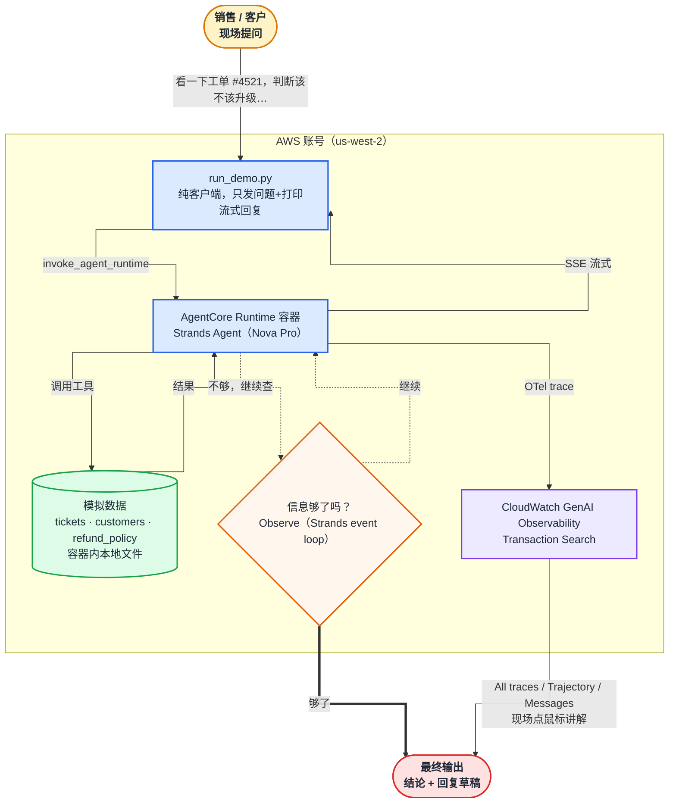

# 架构文档

## 定位与差异化

面向对象是**销售**，不是架构师/工程师——这一点决定了整份设计的边界：不讲 API、不讲代码、不做命令行操作，只讲"客户能听懂的价值故事"和"销售自己也能上手演示"的现场脚本。

目标：培训结束后，销售能（1）用一句话讲清楚 Agent Loop 和普通聊天机器人的区别，（2）独立跑一遍现场演示不出错，（3）应对客户 3-5 个高频追问。

时长/场次结构：本次培训是"15 分钟 PPT + 15 分钟 demo"组合场次的后半段。PPT 部分（讲 Agent Loop 概念本身）不在本文档设计范围内；本文档只设计 **15 分钟 demo** 部分，定位是给 PPT 里的理论做一次具体印证，不重复讲一遍概念。

## 核心场景：客服工单升级判定 + 回复起草

选择**客服工单智能升级判定**作为核心场景，原因是打单效果的考量：AWS 账单优化这类"一键报表"AWS 自己的 Trusted Advisor / Cost Explorer 已经做到了，客户很容易反应过来"这不就是换了个壳"，削弱"AI 自己决定下一步"这个核心卖点。客服工单场景目前没有任何现成系统能端到端自动完成，而且几乎所有行业（零售/SaaS/金融/电信）都有客服工单，销售面向任何客户都能用上，不需要临时换场景。

客户提问（培训中反复使用的锚点句）：

> "看一下工单 #4521，判断该不该升级，需不需要退款，并草拟回复"

把这一句话拆成 Agent Loop 的 5 个阶段来讲解：

1. **Perceive（感知）** — Agent 读取工单内容和这位客户的历史记录，识别出这不是关键词分类能解决的，需要综合判断。
2. **Plan（规划）** — 拆解成子任务：查客户等级/历史投诉次数 → 比对退款政策规则 → 判断情绪强度。
3. **Act（行动）** — 调用工单系统查询客户历史（只读），不是凭空编。
4. **Observe（观察）** — 判断信息够不够下结论，不够就再查一次相关商品的退换货政策。
5. **Respond（响应）** — 循环终止条件满足后，输出"建议升级 + 原因"，并草拟一封安抚回复。

给销售的一句话卖点：**"这不是关键词分类，是真正综合多个信息源的判断加草拟——现在没有任何工单系统能一键做到这一步。"**

## 技术架构：AgentCore Runtime + Strands Agents SDK + CloudWatch GenAI Observability Trace

最初的落地路线用的是 **AgentCore Harness**——托管的黑盒 agent loop，零代码但循环本身不可见。后来评估下来换成了 **AgentCore Runtime + Strands Agents SDK**：Runtime 只负责托管容器（弹性、鉴权、观测这些"底座"能力），循环本身用 Strands 的 `Agent` 显式写出来，现场除了看 Trace 面板，还能直接打开 `agent/agent.py` 指着几十行代码讲"Perceive→Plan→Act→Observe→Respond 具体是哪几行"——这对"讲清楚 loop 怎么工作"这个培训定位比黑盒配置更有说服力。两条路线的详细取舍见下表。

具体路线：

- 三个工具（`get_ticket`/`get_customer_history`/`get_refund_policy`）用 `@tool` 装饰器写成普通 Python 函数，跟着 Agent 一起打包进容器，运行在 Runtime 托管环境里——不再需要客户端脚本充当"外部工具执行者"。
- Agent 代码本身只有一个 `strands.Agent` 实例 + 一段 system prompt，循环控制（要不要继续调用工具、什么时候该收敛给结论）完全交给 Strands 的 event loop，不是手写 `while` 循环。
- Trace 可视化仍然走 **CloudWatch GenAI Observability** 的 Bedrock AgentCore Observability（All traces / Trajectory / Messages 面板），Runtime 和 Harness 用的是同一套 OTel 观测管线，现场点击路径基本不变。

### Harness vs Runtime 取舍对比

| | AgentCore Harness（旧方案） | AgentCore Runtime + Strands（现方案） |
|---|---|---|
| 循环逻辑 | 托管黑盒，只能看 Trace 反推 | `agent/agent.py` 里显式可见，能直接讲代码 |
| 工具执行位置 | 客户端（`inline_function` 设计如此） | 容器内，随 Agent 一起跑 |
| 部署产物 | 一份 JSON 配置 | 容器镜像（需要 Docker 构建 + 推送 ECR） |
| 自定义能力 | 受限于 Harness 暴露的配置项 | 可自由定制重试、终止条件、多 Agent 编排等 |
| 适合场景 | 快速验证、纯配置演示 | 需要"讲清楚循环怎么工作"的培训场景 |

### 架构图

组件构成（具体部署步骤见 [deployment.md](deployment.md)）：

| 组件 | 文件 | 作用 |
|---|---|---|
| 模拟数据集 | `data/tickets.json`、`data/customers.json`、`data/refund_policy.json` | 3 个工单覆盖"明显该升级"（#4521）、"明显不该升级"（#4522）、"边界情况"（#4523）三种对照 |
| Runtime 执行角色 + ECR 仓库 | `infra/runtime-role.yaml` | CloudFormation 模板（声明式），最小权限（Bedrock 调用、ECR 拉镜像、日志、X-Ray、workload identity），不含 AgentCore Memory 权限（本场景无需跨会话记忆） |
| Agent 代码 | `agent/agent.py` | Strands `Agent` + 三个 `@tool` 函数，`BedrockAgentCoreApp` 的 `@app.entrypoint` 把 `agent.stream_async` 的事件转成 SSE 流式返回 |
| 容器构建 | `agent/Dockerfile`、`agent/requirements.txt` | ARM64 镜像（AgentCore Runtime 要求），构建上下文是仓库根目录，同时打包 `data/`；`CMD` 用 `opentelemetry-instrument` 包装启动，配合 `requirements.txt` 里的 `aws-opentelemetry-distro` 做自动 OTel 埋点——这一步不是可选项，少了它 Runtime 不会自动上报任何 trace（详见 [testing.md](testing.md) 里踩过的坑） |
| Runtime 声明式配置 | `runtime/runtime-config.json` | `create-agent-runtime` 的输入：容器镜像地址、网络模式（PUBLIC）、协议（HTTP） |
| 调用脚本 | `scripts/run_demo.py` | 纯客户端：发一次问题，解析 `invoke_agent_runtime` 返回的 SSE 流并实时打印文本；循环本身完全在 Runtime 容器里跑完，脚本不再处理工具调用 |
| 控制台点击脚本 | `docs/console-walkthrough.md` | 现场演示时 CloudWatch 控制台的逐屏点击路径 |

## 模型选型（结论）

原计划用 Claude，但 Bedrock 调用被账号级地域限制挡住（"Access to Anthropic models is not allowed from unsupported countries"，与 API 请求指定的区域无关）。这个限制在正式培训要用的账号上反复复测确认持续存在，**Claude 在这次培训里确定不可用**。

- **Amazon Nova Pro**（`us.amazon.nova-pro-v1:0`）—— 这次改造后**唯一实测过的模型**，#4521/#4522/#4523 三个对照工单各跑 1 次，判断方向全部正确，全流程 7.9-10.4 秒。详见 [testing.md](testing.md)。
- kimi-k2-thinking 此前在 **Harness** 方案下验证过稳定（见该方案的历史测试记录），但 Runtime + Strands 是完全不同的循环实现，**尚未在这套新方案下复测**，如果要切回 Kimi 系列模型，必须重新走一遍模型稳定性测试，不能直接复用 Harness 时代的结论。

## 演示流程设计（15 分钟，衔接前面 15 分钟 PPT）

1. **开场对比**（2 分钟）——直接引用 PPT 里刚讲过的"单轮问答 vs Agent Loop"概念，一句话带到"现在看真实的跑一遍"，不重复讲理论。
   **衔接台词（同一人主讲，PPT 和 demo 无缝衔接）**："刚才讲的是 Agent Loop 理论上该怎么工作——Perceive、Plan、Act、Observe、Respond 这五步。光讲概念比较抽象，现在不讲了，直接拿一个真实工单跑一遍给大家看，边跑边指给你们看这五步具体发生在哪。"
2. **现场演示**（9-10 分钟）——真实跑一遍工单场景，在 Trace 面板里逐步讲解 Perceive→Plan→Act→Observe→Respond 5 个阶段（具体点击路径见 [console-walkthrough.md](console-walkthrough.md)）；"循环怎么知道该停"就在讲 Observe 那一步时顺带说清楚，不单独留时间段。
3. **收尾 + 卖点重申**（2-3 分钟）——重复那句话术卖点，预告"常见问题详见发给你们的 battle card"，留 1-2 个问题的现场问答缓冲。

时间风险评估：模型推理本身只要 8-10 秒（见 [testing.md](testing.md#性能基准)），9-10 分钟预算里的瓶颈和不确定性全部来自"讲解 CloudWatch 控制台"这一步，不是模型响应慢。

风险控制：备好一份录屏/截图作为 backup（见 `docs/screenshots/`），防止现场网络或权限问题导致 live demo 失败。

## 常见客户问题与话术要点（battle card，演示结束后作为书面材料发给销售）

- **"这和普通 chatbot 有什么区别？"** → 普通 chatbot 一问一答、答案基于训练时的记忆；Agent Loop 会自己规划步骤、调用真实系统查最新数据、判断信息够不够，不够会自己继续查，最后才给结论。
- **"这不就是关键词分类/工单路由规则引擎吗？"** → 规则引擎只能匹配预先想到的固定条件；这里是模型综合客户等级、历史投诉、退款政策、情绪强度等多个维度做判断，遇到规则引擎没覆盖的边界情况也能给出有依据的结论，而不是命中不了规则就转人工。
- **"客户隐私资料会不会被乱用/泄露给模型训练？"** → 强调 Agent 代码里的工具只做只读查询、容器运行在 Runtime 的隔离环境里，且模型侧不会把调用数据用于训练；如果客户对数据驻留/合规有更高要求，Runtime 支持 VPC 网络模式。这是客服场景比账单场景更容易被追问的点，必须准备好。
- **"这个只能用来做工单分诊吗？"** → 强调这是通用的 Agent Loop 模式，换一套工具就能迁移到任何"多步骤查证 + 决策"的业务场景，工单只是今天挑的一个好懂的例子。
- **"要开发多久才能给我们客户定制一个？"** → 如实说明：核心壁垒不在"循环"本身（Strands 的 event loop 已经封装好），而在于给每个客户接入他们自己的业务系统（把工具函数换成真实 API 调用，或接入 Gateway/MCP），这部分需要具体评估工作量，避免现场夸口。
